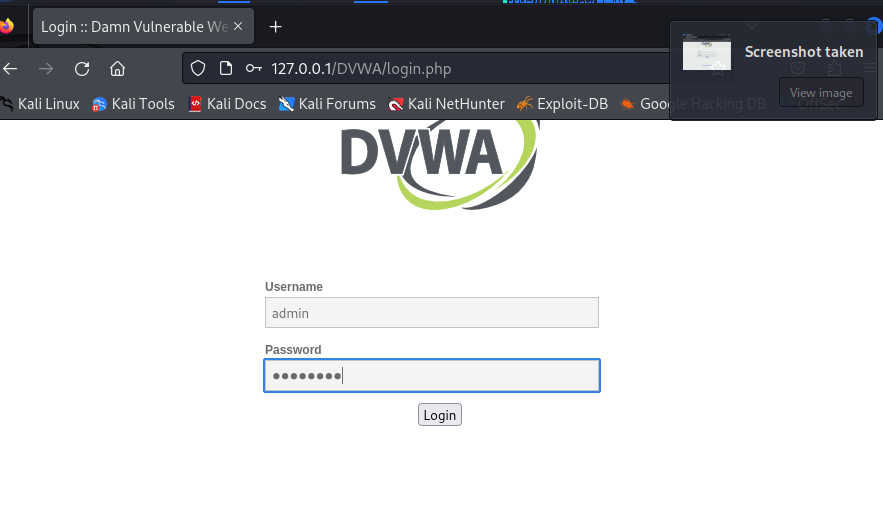
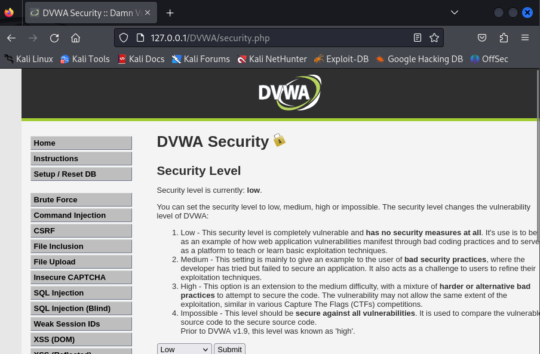
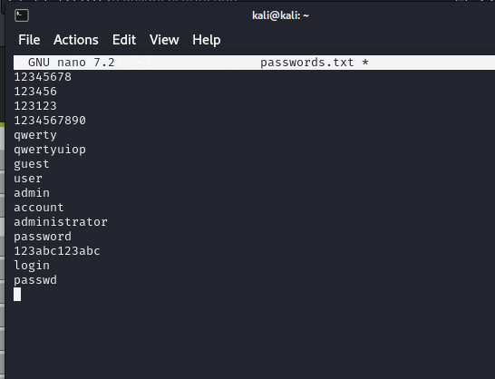
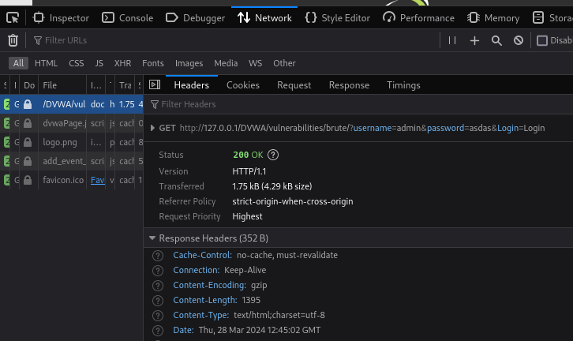
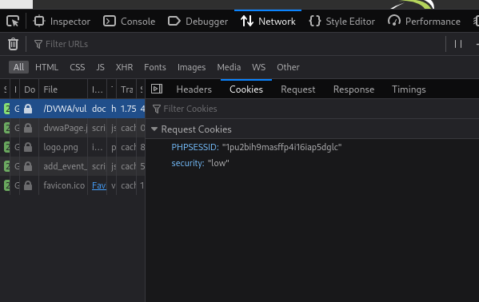
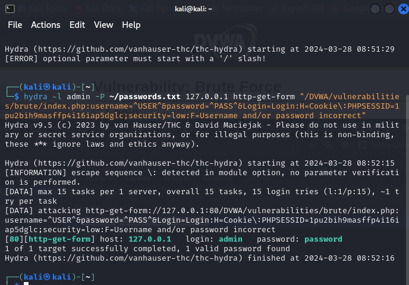
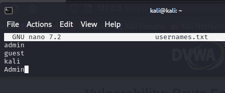
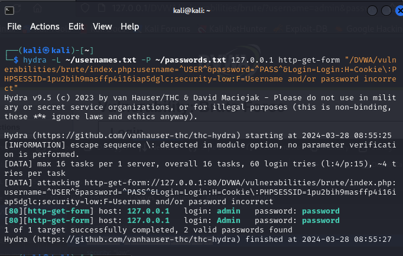

---
## Front matter
title: "Отчёт по индивидуальному проекту №3"
subtitle: "Дисциплина: Основы информационной безопасности"
author: "Барсегян Вардан Левонович НПИбд-01-22"

## Generic otions
lang: ru-RU
toc-title: "Содержание"

## Bibliography
bibliography: bib/cite.bib
csl: pandoc/csl/gost-r-7-0-5-2008-numeric.csl

## Pdf output format
toc: true # Table of contents
toc-depth: 2
lof: true # List of figures
lot: true # List of tables
fontsize: 12pt
linestretch: 1.5
papersize: a4
documentclass: scrreprt
## I18n polyglossia
polyglossia-lang:
  name: russian
polyglossia-otherlangs:
  name: english
## I18n babel
babel-lang: russian
babel-otherlangs: english
## Fonts
mainfont: Arial
romanfont: Arial
sansfont: Arial
monofont: Arial
mainfontoptions: Ligatures=TeX
romanfontoptions: Ligatures=TeX
sansfontoptions: Ligatures=TeX,Scale=MatchLowercase
monofontoptions: Scale=MatchLowercase,Scale=0.9
## Biblatex
biblatex: true
biblio-style: "gost-numeric"
biblatexoptions:
  - parentracker=true
  - backend=biber
  - hyperref=auto
  - language=auto
  - autolang=other*
  - citestyle=gost-numeric
## Pandoc-crossref LaTeX customization
figureTitle: "Рис."
tableTitle: "Таблица"
listingTitle: "Листинг"
lofTitle: "Список иллюстраций"
lotTitle: "Список таблиц"
lolTitle: "Листинги"
## Misc options
indent: true
header-includes:
  - \usepackage{indentfirst}
  - \usepackage{float} # keep figures where there are in the text
  - \floatplacement{figure}{H} # keep figures where there are in the text
---

# Цель работы

Знакомство с Hydra для подбора или взлома имени пользователя и пароля.

# Выполнение лабораторной работы

1. Открываю в браузере страницу http://127.0.0.1/DVWA/login.php и вхожу в DVWA (рис. [-@fig:001])

{ #fig:001 width=70% }

2. Открываю страницу http://127.0.0.1/DVWA/security.php и выставляю уровень безопасности на низкий (рис. [-@fig:002])

{ #fig:002 width=70% }

3. Создаю файл с паролями, в него ввожу самые распространенные пароли (рис. [-@fig:003])

{ #fig:003 width=70% }

4. Перехожу во вкладку Brute Force, где можно подобрать комбинацию логина и пароля и проверить, верна ли она. Во вкладке Network консоли разработчика смотрю запрос для валидации логина и пароля - это GET-запрос, отправляющий логин, пароль в качестве параметров (рис. [-@fig:004])

{ #fig:004 width=70% }

5. Куки GET-запроса - уровень безопасности и id сессии (рис. [-@fig:005])

{ #fig:005 width=70% }

6. Ввожу команду для hydra:  (рис. [-@fig:006])

'''
hydra -l admin -P ~/passwords.txt 127.0.0.1 http-get-form "/DVWA/vulnerabilities/brute/:username=^USER^&password=^PASS^&Login=Login:H=Cookie\:PHPSESSID=1pu2bih9masffp4i16iap5dglc;security=low:F=Username and/or password incorrect"
'''

ключ -l –	логин для входа
ключ -P –	пароль для входа, берутся все возможные из файла ~/passwords.txt
http-get-form – тип запроса (GET)
дополнительный параметр (длинная строка) - полный путь, параметры, куки, и сообщение при ошибке

В результате, hydra подобрала верную комбинацию: логин admin и пароль password

{ #fig:006 width=70% }

7. Создаю файл с возможными логинами (рис. [-@fig:007])

{ #fig:007 width=70% }

8. Изменяю команду для hydra: указываю ключ -L ~/usernames.txt, чтобы логины ткаже перебирались из файла (рис. [-@fig:008])

'''
hydra -L ~/usernames.txt -P ~/passwords.txt 127.0.0.1 http-get-form "/DVWA/vulnerabilities/brute/:username=^USER^&password=^PASS^&Login=Login:H=Cookie\:PHPSESSID=1pu2bih9masffp4i16iap5dglc;security=low:F=Username and/or password incorrect"
'''

{ #fig:008 width=70% }

# Выводы

Я познакомился с hydra, научился подбирать логины и пароли с помощью нее, отправляя запросы.

# Список литературы{.unnumbered}

::: {#refs}
:::